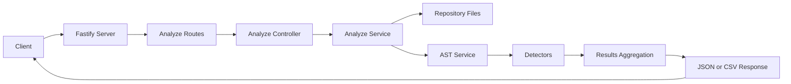
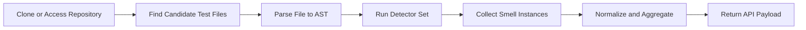

# SNUTS.js: Sniffing Nasty Unit Test Smells in JavaScript

SNUTS.js is a Fastify API that analyzes public JavaScript repositories and detects test smells in Jest and Jasmine test suites.

## Learning Resources

- Demo video: https://youtu.be/89z0jy4Nu0s
- Paper (SBES): https://sol.sbc.org.br/index.php/sbes/article/download/30417/30223/

## Technology Stack

- Node.js (runtime)
- Fastify (HTTP API)
- JavaScript (ES Modules)
- Yarn (package manager)
- Babel parser and traversal tools (AST parsing and analysis)
- Vitest (unit testing)
- ESLint (static code analysis)
- PM2 (process management in production-like runs)

## Project Goal

Given a repository URL, the API clones and analyzes test files to identify test smell patterns, such as overly verbose tests, duplicated descriptions, assertions in setup hooks, and more.

## Architecture

SNUTS.js follows a simple layered architecture:

- HTTP layer: Fastify server and routes (`src/server.js`, `src/routes/analyze.route.js`)
- Application layer: controllers orchestrate requests (`src/controllers/analyze.controller.js`)
- Domain layer: services parse repository content and run smell detectors (`src/services`, `src/common/detectors`)
- Output layer: JSON API responses and CSV export

### Request Flow



### Detector Pipeline



### Codebase Landmarks

- `src/server.js`: API bootstrap, plugins, route registration, health endpoints
- `src/routes/analyze.route.js`: public API endpoints and request schemas
- `src/controllers/analyze.controller.js`: endpoint handlers
- `src/services/analyze.service.js`: repository analysis orchestration
- `src/services/ast.service.js`: AST parsing and AST helper utilities
- `src/common/detectors`: detector implementations (each detector focuses on one smell)
- `test/common/detectors`: detector unit tests

## Getting Started

### Prerequisites

- Node.js 18+
- Yarn 1.x

### Installation

```sh
git clone https://github.com/Jhonatanmizu/snutsjs.git
cd snutsjs
yarn
```

### Run the API

Development mode (recommended while coding):

```sh
yarn start:dev
```

Production-like mode (PM2):

```sh
yarn start
```

By default, the API runs on `http://localhost:3000`.
You can customize host and port with environment variables:

```sh
HOST=0.0.0.0 PORT=3000 yarn start:dev
```

## API Reference

Swagger UI:

- `GET /documentation`

Health and diagnostics:

- `GET /ping` -> `{ "message": "pong" }`
- `GET /health` -> `{ "status": "ok" }`

Analysis endpoints:

- `GET /`
  - Returns available smell types and API metadata.
- `POST /`
  - Analyze a repository and return detected smells.
  - Body:
    - `repository` (string, required): Public Git repository URL.
- `POST /count`
  - Count test files in a repository.
  - Body:
    - `repository` (string, required)
- `POST /export-csv`
  - Analyze and return CSV output.
  - Body:
    - `repository` (string, required)

## How To Use

Run a repository smell analysis:

```sh
curl -X POST http://localhost:3000/ \
  -H "Content-Type: application/json" \
  -d '{"repository":"https://github.com/facebook/jest"}'
```

Count test files:

```sh
curl -X POST http://localhost:3000/count \
  -H "Content-Type: application/json" \
  -d '{"repository":"https://github.com/facebook/jest"}'
```

Export CSV:

```sh
curl -X POST http://localhost:3000/export-csv \
  -H "Content-Type: application/json" \
  -d '{"repository":"https://github.com/facebook/jest"}'
```

## Development Workflow

Run tests:

```sh
yarn test
```

Watch mode:

```sh
yarn test:watch
```

Coverage:

```sh
yarn test:coverage
```

Lint:

```sh
yarn lint
```

## Contributing

Contributions are welcome. To keep the codebase healthy, use this flow:

1. Fork the repository and create a focused branch.
2. Keep changes small and scoped to one concern.
3. Add or update tests for every behavior change.
4. Run `yarn test` and `yarn lint` locally.
5. Open a Pull Request with:
   - clear problem statement
   - implementation summary
   - test evidence (what you ran and why it is sufficient)

### Contribution Tips

- Prefer detector changes with paired unit tests under `test/common/detectors`.
- If you add a new detector, export it in `src/common/detectors/index.js`.
- Keep endpoint behavior and README documentation in sync.

## License

MIT. See `LICENSE.md`.
